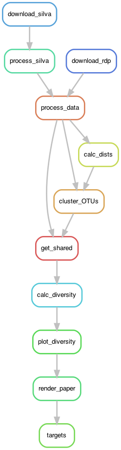

<!-- README.md is generated from README.Rmd. Please edit that file -->

# MiSeq-SOP-demo

<!-- badges: start -->

<!-- badges: end -->

## Dependencies

- mothur
- R
- snakemake

R packages:

- here
- schtools
- tidyverse

## Re-using this template

If you re-use this template for a real project, you’ll need to fill in
some information in the following files:

- [LICENSE.md](LICENSE.md)
  - `YEAR`
  - `AUTHORS`
  - `FIRST_AUTHOR_LASTNAME`
  - `GITHUB_URL`
- MiSeq-SOP-demo.Rproj - rename this file to match your project.
- [paper/head.tex](paper/head.tex)
  - `RUNNING TITLE`
  - `FIRST AUTHOR LASTNAME`
  - `AUTHORS AND AFFILIATIONS`
- [paper/paper.Rmd](paper/paper.Rmd)
  - `TITLE`
  - Write the actual text of your paper. 🤓
- [paper/references.bib](paper/references.bib) - export your references
  from Zotero (or other reference manager) to this bibtex file.
- README.md - don’t edit this by hand, it’s created by knitting
  [README.Rmd](README.Rmd).
- [README.Rmd](README.Rmd).
  - `MiSeq-SOP-demo` - your project slug.
  - Change the text as you see fit to explain your project.

## Directory Structure

    .
    ├── LICENSE.md
    ├── MiSeq-SOP-demo.Rproj
    ├── README.Rmd
    ├── config
    │   ├── README.md
    │   ├── crc
    │   ├── demo.yaml
    │   └── slurm
    ├── data
    │   ├── README.md
    │   ├── miseqsopdata.zip
    │   ├── mothur
    │   ├── raw
    │   └── references
    ├── figures
    │   ├── dag_crc.png
    │   ├── dag_demo.png
    │   ├── rulegraph_crc.png
    │   ├── rulegraph_demo.png
    │   └── stability_alpha-diversity.pdf
    ├── log
    │   ├── hpc
    │   ├── mothur
    │   └── render_readme.log
    ├── paper
    │   ├── head.tex
    │   ├── mbio.csl
    │   ├── paper.Rmd
    │   ├── paper.md
    │   ├── paper.pdf
    │   ├── preamble.tex
    │   └── references.bib
    └── workflow
        ├── Snakefile
        ├── envs
        ├── notebooks
        └── scripts

    16 directories, 21 files

## Workflow

See [config/README.md](config/README.md) for instructions on configuring this workflow for your own dataset.

<!-- run workflow/scripts/plot_rulegraph_dag.sh to generate this -->

